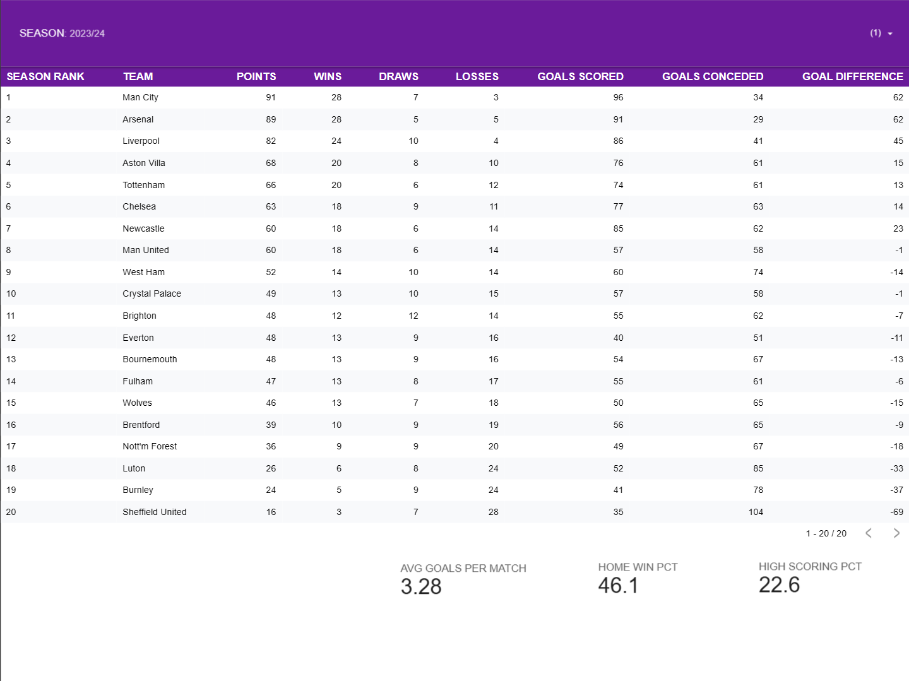
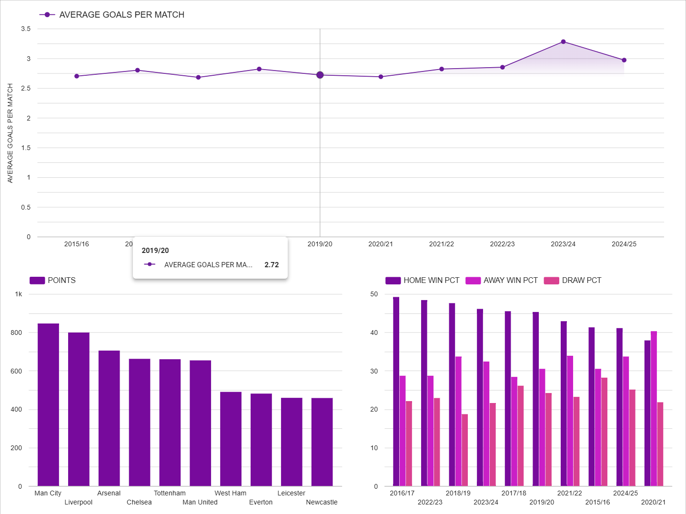

# EPL Analysis Pipeline

> **End-to-end batch data pipeline for English Premier League match analysis (2015–2025)**  
> Built with Bruin · PySpark · Snowflake · dbt Core · Looker Studio



---

## Problem Statement

Football analytics generates massive amounts of match data every season. This project builds a complete data engineering pipeline to ingest, transform and visualize 10 seasons of English Premier League data (2015/16 → 2024/25), answering key business questions:

- Which teams dominated each season by points and rank?
- How have win rates and goals scored/conceded trended over time?
- Is there a measurable home advantage in the Premier League?
- How has average goals per match evolved across seasons?
- Who are the top performing teams across a decade?

---

## Architecture

```
┌─────────────────────────────────────────────────────────────────┐
│                        BATCH PIPELINE                           │
│                                                                 │
│  Kaggle CSV          Bruin           PySpark (local WSL)        │
│  (9,380 rows)  ───►  orchestration ──► transform + enrich       │
│  25 seasons          pipeline.yml      CSV → Parquet            │
│                          │                    │                 │
│                          ▼                    ▼                 │
│                     Snowflake ◄────── Parquet files             │
│                     EPL_DB.RAW        partitioned by season     │
│                          │                                      │
│                          ▼                                      │
│                     dbt Core                                    │
│                     STAGING views + MARTS tables                │
│                          │                                      │
│                          ▼                                      │
│                     Looker Studio                               │
│                     Live dashboard                              │
└─────────────────────────────────────────────────────────────────┘
```



---

## Dashboard

🔗 **[View Live Dashboard](https://lookerstudio.google.com/reporting/5dd1bf4b-4c23-4d38-a392-7f32a3cb27bb)**

The dashboard contains two pages:

**Page 1 — League Table**


**Page 2 — Trends & Performance**


---

## Tech Stack

| Layer | Tool | Why |
|---|---|---|
| Orchestration | [Bruin](https://bruin-data.github.io/bruin/) | Modern pipeline orchestration with Python assets and dependency management |
| Ingestion | Python + Kaggle API | Pulls EPL dataset directly from Kaggle |
| Processing | PySpark (local) | Distributed-style transformation — flattens, enriches, writes Parquet |
| Data Lake | Parquet (partitioned) | Columnar format, partitioned by `season_start_year` for fast reads |
| Data Warehouse | Snowflake | Cloud DWH with auto-suspend warehouse to minimize cost |
| Transformation | dbt Core | SQL models with staging → intermediate → marts layering |
| Visualization | Looker Studio | Free BI tool with native Snowflake connector |
| Package manager | uv | Fast Python dependency management |
| Environment | WSL Ubuntu + Python 3.11 | Native Linux toolchain on Windows |

---

## Data Warehouse Design

### Snowflake Schema

```
EPL_DB
├── RAW
│   └── MATCHES                  ← raw data loaded from Parquet
├── STAGING
│   ├── stg_matches              ← cleaned, typed view
│   └── int_team_stats           ← home/away aggregated view
└── MARTS
    ├── fct_league_table         ← points, rank, win rate per team per season
    └── fct_match_kpi            ← goals, home advantage, trends per season
```

### Optimization

Tables are clustered for query performance:

```sql
-- Optimizes season-range scans in dbt staging models
ALTER TABLE EPL_DB.RAW.MATCHES
CLUSTER BY (SEASON, MATCH_DATE);

-- Optimizes per-season league table lookups in dashboard
ALTER TABLE EPL_DB.MARTS.FCT_LEAGUE_TABLE
CLUSTER BY (SEASON, SEASON_RANK);
```

Snowflake warehouse (`EPL_WH`) is configured with:
- Size: `X-SMALL` (sufficient for this data size)
- `AUTO_SUSPEND = 60` seconds — stops billing when idle
- `AUTO_RESUME = TRUE` — resumes automatically on query

---

## dbt Models

```
epl_dbt/models/
├── staging/
│   ├── sources.yml              ← Snowflake RAW source definition
│   ├── schema.yml               ← column tests
│   ├── stg_matches.sql          ← clean + type raw matches
│   └── int_team_stats.sql       ← aggregate per team per season (home + away)
└── marts/
    ├── schema.yml               ← column tests
    ├── fct_league_table.sql     ← points, rank, win rate, goal diff
    └── fct_match_kpi.sql        ← avg goals, home/away %, trends
```

### Business Questions → dbt Models

| Business Question | Model |
|---|---|
| Points per team, rank per season | `fct_league_table` |
| Win rate | `fct_league_table` |
| Goals scored / conceded | `fct_league_table` |
| Home vs away advantage | `fct_match_kpi` |
| Avg goals per match | `fct_match_kpi` |
| Performance over time | `fct_match_kpi` |
| Top teams per season | `fct_league_table` |

---

## Project Structure

```
EPL Analysis/
├── .bruin.yml                        # Bruin root config + Snowflake connection
├── .env                              # credentials (not committed)
├── .env.example                      # credential template
├── pyproject.toml                    # uv dependencies
│
├── bruin/                            # Bruin pipeline
│   ├── pipeline.yml                  # asset DAG + dependencies
│   └── assets/
│       ├── ingest_kaggle.py          # validate + profile raw CSV
│       ├── spark_transform.py        # CSV → Parquet via PySpark
│       ├── load_snowflake.py         # Parquet → Snowflake RAW
│       └── run_dbt.py                # trigger dbt run + test
│
├── spark/
│   └── transform.py                  # standalone PySpark script
│
├── epl_dbt/                          # dbt project
│   ├── dbt_project.yml
│   ├── profiles.yml                  # Snowflake connection (not committed)
│   └── models/
│       ├── staging/
│       │   ├── sources.yml
│       │   ├── schema.yml
│       │   ├── stg_matches.sql
│       │   └── int_team_stats.sql
│       └── marts/
│           ├── schema.yml
│           ├── fct_league_table.sql
│           └── fct_match_kpi.sql
│
├── data/
│   ├── raw/                          # epl_final.csv (Kaggle source)
│   └── staging/                      # Parquet files (partitioned by season)
│       └── epl_matches.parquet/
│           ├── season_start_year=2015/
│           ├── season_start_year=2016/
│           └── ...
│
└── logs/                             # Bruin + dbt run logs
```

---

## Dataset

- **Source:** [EPL Match Data 2000–2025](https://www.kaggle.com/datasets/marcohuiii/english-premier-league-epl-match-data-2000-2025) on Kaggle
- **Pipeline scope:** 2015/16 → 2024/25 (10 seasons)
- **Total matches:** 3,770
- **Columns:** Season, Date, Teams, Goals (FT + HT), Shots, Corners, Fouls, Cards

> **Note:** The 2024/25 season contains 350/380 matches due to a data gap in the source
> Kaggle dataset. The pipeline is fully functional — re-run `bruin run` once the dataset
> is updated on Kaggle for complete data.

---

## Reproducibility

### Prerequisites

```bash
# Required
- WSL Ubuntu (or Linux/macOS)
- Python 3.11
- Java 11+ (for PySpark)
- Bruin CLI
- Snowflake account (free trial at snowflake.com)
- Kaggle account + API token
```

### Installation

```bash
# 1. Clone the repository
git clone https://github.com/YOUR_USERNAME/epl-analysis.git
cd epl-analysis

# 2. Install uv (fast Python package manager)
curl -LsSf https://astral.sh/uv/install.sh | sh
source ~/.bashrc

# 3. Install Bruin CLI
curl -LsSf https://raw.githubusercontent.com/bruin-data/bruin/main/install.sh | sh
source ~/.bashrc

# 4. Create virtual environment and install dependencies
uv venv --python 3.11
source .venv/bin/activate
uv sync

# 5. Configure credentials
cp .env.example .env
# Edit .env and fill in:
#   SNOWFLAKE_ACCOUNT, SNOWFLAKE_USER, SNOWFLAKE_PASSWORD
#   FOOTBALL_API_TOKEN (from football-data.org)
```

### Snowflake Setup

Run this SQL in your Snowflake worksheet:

```sql
USE ROLE ACCOUNTADMIN;
USE WAREHOUSE COMPUTE_WH;

CREATE DATABASE IF NOT EXISTS EPL_DB;
CREATE SCHEMA IF NOT EXISTS EPL_DB.RAW;
CREATE SCHEMA IF NOT EXISTS EPL_DB.STAGING;
CREATE SCHEMA IF NOT EXISTS EPL_DB.MARTS;

CREATE WAREHOUSE IF NOT EXISTS EPL_WH
  WITH WAREHOUSE_SIZE = 'X-SMALL'
  AUTO_SUSPEND = 60
  AUTO_RESUME = TRUE
  INITIALLY_SUSPENDED = TRUE;
```

### Download Dataset

```bash
# Configure Kaggle credentials
mkdir -p ~/.config/kaggle
cp /path/to/kaggle.json ~/.config/kaggle/
chmod 600 ~/.config/kaggle/kaggle.json

# Download EPL dataset
kaggle datasets download \
  marcohuiii/english-premier-league-epl-match-data-2000-2025 \
  --unzip -p data/raw/
```

### Configure dbt

```bash
# Copy the example and fill in your credentials
# File location: ~/.dbt/profiles.yml
```

### Run the Pipeline

```bash
# Run full end-to-end pipeline (all 4 assets in dependency order)
bruin run \
  --start-date 2026-03-30T00:00:00.000Z \
  --end-date 2026-03-30T23:59:59.999Z \
  --environment default \
  bruin/
```

This executes in order:
1. `ingest_kaggle` — validates raw CSV (columns, seasons, nulls)
2. `spark_transform` — cleans and writes Parquet partitioned by season
3. `load_snowflake` — loads 3,770 rows into `EPL_DB.RAW.MATCHES`
4. `run_dbt` — builds 4 dbt models and runs data quality tests

### Run dbt Independently

```bash
cd epl_dbt
dbt run     # build all models
dbt test    # run data quality tests
```

---

## Data Quality Tests

dbt tests defined in `schema.yml`:

| Model | Test | Column |
|---|---|---|
| `stg_matches` | `not_null` | `match_date`, `home_team`, `away_team`, `result` |
| `stg_matches` | `accepted_values` (H/A/D) | `result` |
| `int_team_stats` | `not_null` | `team`, `season` |
| `fct_league_table` | `not_null` | `team`, `season`, `points`, `season_rank` |
| `fct_match_kpi` | `not_null` + `unique` | `season` |

---

## Key Findings

- **2023/24** had the highest avg goals per match (3.28) in the 10-season dataset
- **Home advantage** has been declining — home win % dropped from ~49% (2015/16) to ~41% (2024/25)
- **Man City** accumulated the most points across the 10-season period
- **2020/21** (COVID bubble season with no fans) showed the lowest home win % — validating that crowd support affects home advantage
